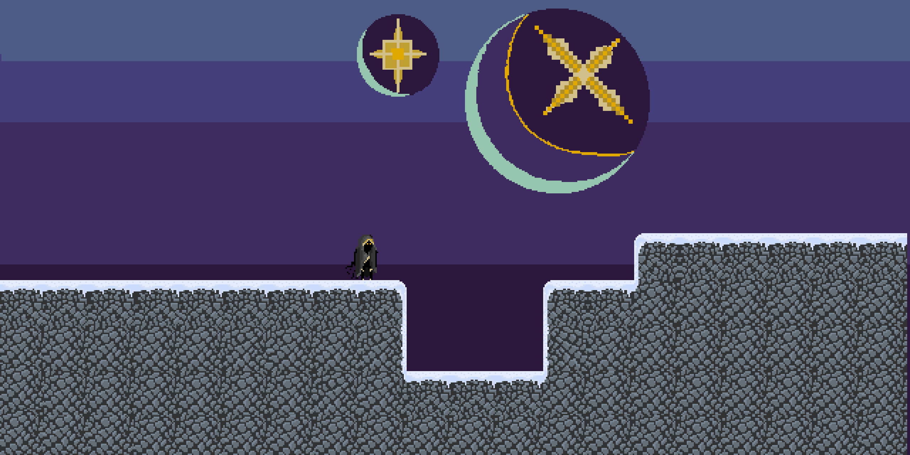
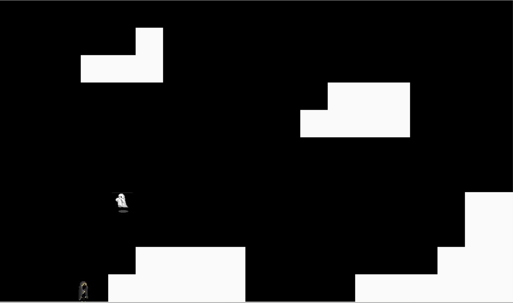
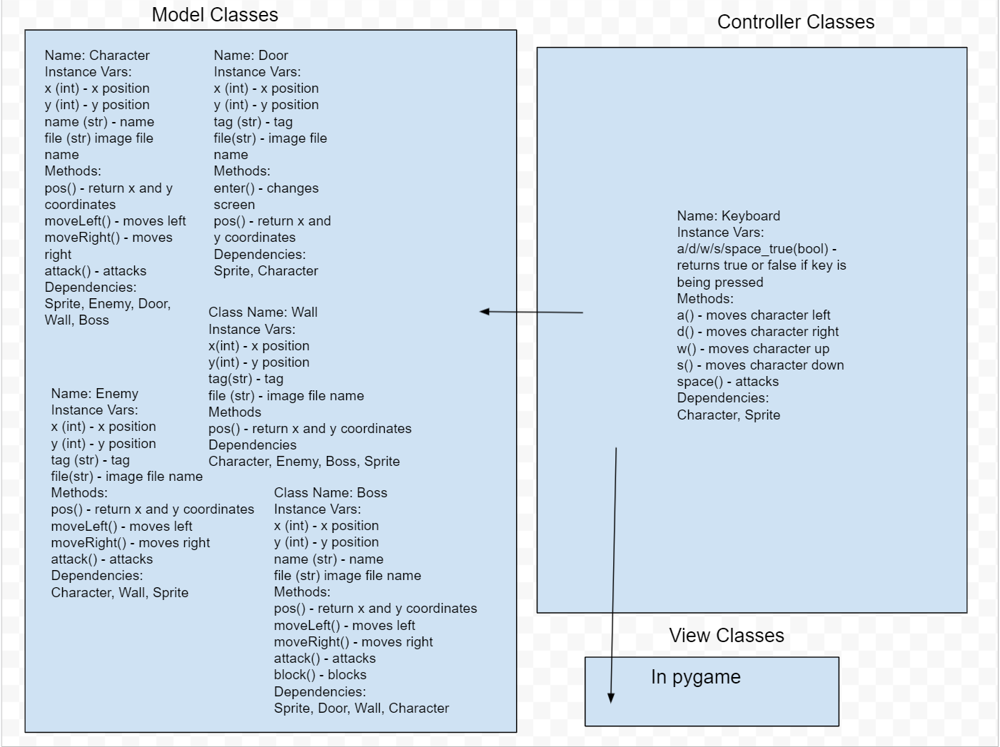

# CS110 Project Proposal
# Vagabond Game
## CS 110 Final Project
### Fall 2021
### [Assignment Description](https://docs.google.com/document/d/1H4R6yLL7som1lglyXWZ04RvTp_RvRFCCBn6sqv-82ps/edit#)

[https://docs.google.com/document/d/1H4R6yLL7som1lglyXWZ04RvTp_RvRFCCBn6sqv-82ps/edit#](#)

<< [link to demo presentation slides](#) >>

### Team: Ampalker
#### John Paul Alker, Paul Ampadu

***

## Project Description *(Software Lead)*
Our project is of a game that has an enemy ghost move randomly on the screen. The main character has unlimited double jumps (to kill the ghosts) and fights ghosts in the game. When the enemy collides with the ghost, there is a chance that the character himself will die, because he cannot win every battle. In that event, he will lose a hitpoint. After he loses all of his hitpoints, a game over screen will appear. If he kills all enemies on the screen, however, a game won screen will appear.

***    

## User Interface Design *(Front End Specialist)*

* This is the start menu
   
   
   

* This is the first design concept for the map

* This is the final game GUI

   

***        

## Program Design *(Backend Specialist)*
* Non-Standard libraries
    * Pygame 
        * https://docs.google.com/document/d/1H4R6yLL7som1lglyXWZ04RvTp_RvRFCCBn6sqv-82ps/edit#
        * Pygame is a game library for python
* Class Interface Design
    * 

## Project Structure *(Software Lead)*

The Project is broken down into the following file structure:
* main.py
* bin
    * <all of your python files should go here>
* assets
    * <all of your media, i.e. images, font files, etc, should go here)
* etc
    * <This is a catch all folder for things that are not part of your project, but you want to keep with your project. Your demo video should go here.>

***

## Tasks and Responsibilities *(Software Lead)*

### Software Lead - Paul Ampadu and John Paul Alker

We both worked on the integration of classes and the controller, and collaborated on design features of the project. We intermingled in both front-end and back-end roles, collaborating with each other.

### Front End Specialist - Paul Ampadu

Front-end lead constructed the GUI and controller class for the game. Also aided with classes, specifically the Level, Constants, and Button class. Much of the work was collaborative between front end and back end. 

### Back End Specialist - John Paul Alker

Back-end specialist created Character, Door, Enemy, Saver, and Tiles class, and aided with the construction of the controller. Much of the work was collaborative between front end and back end. 

## Testing *(Software Lead)*
* After all of the code was finished for our final project, we pushed everything that we had to github and ran the program. We went through every feature in the game to see if it worked, recording the results in the ATP. For example, the program was to exit after the exit button on the menu was pressed. To see if this worked, we ran the code and clicked on the exit menu button after the program ran. If it worked, the program was to close. When we did end up getting it to close, we pushed the code to github. 

 Your ATP

| Step                  | Procedure     | Expected Results  | Actual Results |
| ----------------------|:-------------:| -----------------:| -------------- |
|  1  | Run game through terminal  | Menu appears with "Vagrant" title, exit and start screen  |     correct     |
|  2  | Click exit button  | Program exits |         correct        |
|  3  | Run game through terminal  | Menu appears with "Vagrant" title, exit and start screen  |     correct     |
|  4  | Click start button  | Map appears with character and enemies|         correct        |
|  5  | Press the a key  | Character moves left |         correct        |
|  6  | Press the d key  | Character moves right |        correct         |
|  7  | Press the space key  | Character jumps |         correct        |
|  8  | Press the space key many times | Character jumps many times (double jump feature) |        correct         |
|  9  | Collide character with an enemy | A "Hit!" and random dog fact will appear, or or a "Miss!" will appear |        correct         |
|  11  | User exits the program by pressing the top right exit button | Program closes |        correct         |
